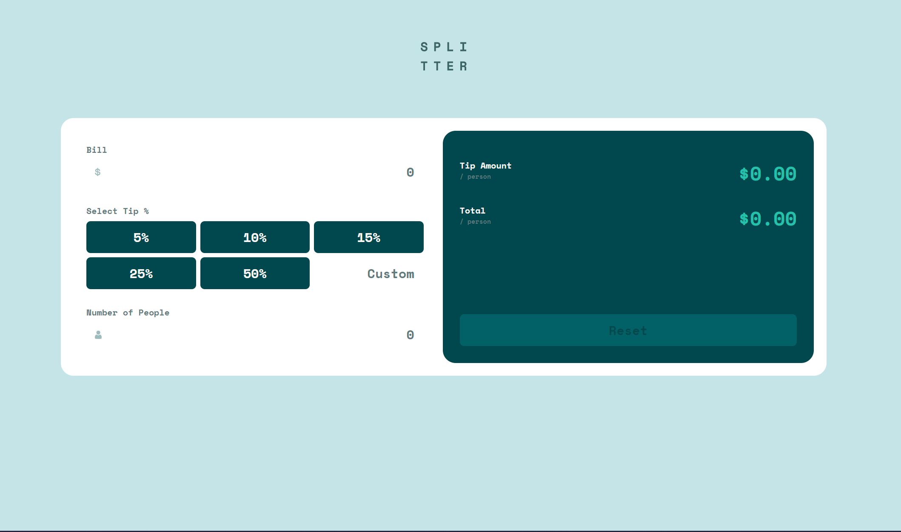
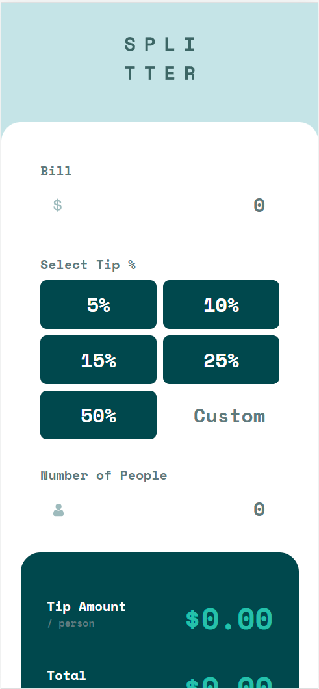

# Frontend Mentor - Tip calculator app solution

This is a solution to the [Tip calculator app challenge on Frontend Mentor](https://www.frontendmentor.io/challenges/tip-calculator-app-ugJNGbJUX). Frontend Mentor challenges help you improve your coding skills by building realistic projects.

## Table of contents

- [Overview](#overview)
- [The challenge](#the-challenge)
- [Screenshot](#screenshot)
- [Links](#links)
- [Built with](#built-with)
- [What I learned](#what-i-learned)
- [Continued development](#continued-development)
- [Useful resources](#useful-resources)
- [Author](#author)

## Overview

This is a solution for the 'Frontend Mentor - Tip calculator app' challenge using Angular 16 with Signals. The app calculates the tip and the total amount to be paid based on the bill amount, the selected tip percentage, and the number of people splitting the bill.

### The challenge

Users should be able to:

- View the optimal layout for the app depending on their device's screen size
- See hover states for all interactive elements on the page
- Calculate the correct tip and total cost of the bill per person

### Screenshot




### Links

- Solution URL: [GITHUB](https://github.com/akkitheakhil/tip-calculator-app.git)
- Live Site URL: [WEB](https://your-live-site-url.com)

### Built with

- [Angular](https://angular.io/) - A web development framework
- Semantic HTML5 markup
- CSS custom properties
- SCSS
- Flexbox
- CSS Grid
- Mobile-first workflow

### What I learned

- Learned how to use Signal's as a primitive data type in Angular

I really love how these compute values work and I see a lot of ways we can use this pattern and reduce the number of code and also optimize the performance by going zoneless change detection in the future.

```typescript
  protected tipAmount = computed(
    () => (this.tip() * this.billAmount()) / 100 || 0
  );

  protected tipAmountPerPerson = computed(
    () => this.tipAmount() / this.persons() || 0
  );

  protected totalAmount = computed(
    () => (this.billAmount() + this.tipAmount()) / this.persons() || 0
  );
```

### Continued development

Look more into Signal and update the current implementation where necessary, with the best practices of using Signal.

### Useful resources

- [Angular - Signal](https://itnext.io/angular-signals-the-future-of-angular-395a69e60062) - This helped me get to know more about using Signals in Angular. I really liked this pattern and will use it going forward.
- [Why Signal](https://github.com/angular/angular/discussions/49090) - Official discussion on why Signal and what we will see in the future stable builds of Angular.

## Author

- Website - [Akhil Padmanabhan Nair](https://akhil-padmanabhan.web.app/)
- Frontend Mentor - [@akkitheakhil](https://www.frontendmentor.io/profile/akkitheakhil)
- Linkedin - [@akhilpadmanabhan](https://www.linkedin.com/in/akhilpadmanabhan/)
